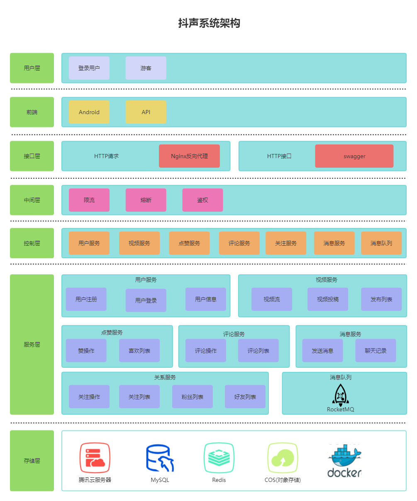
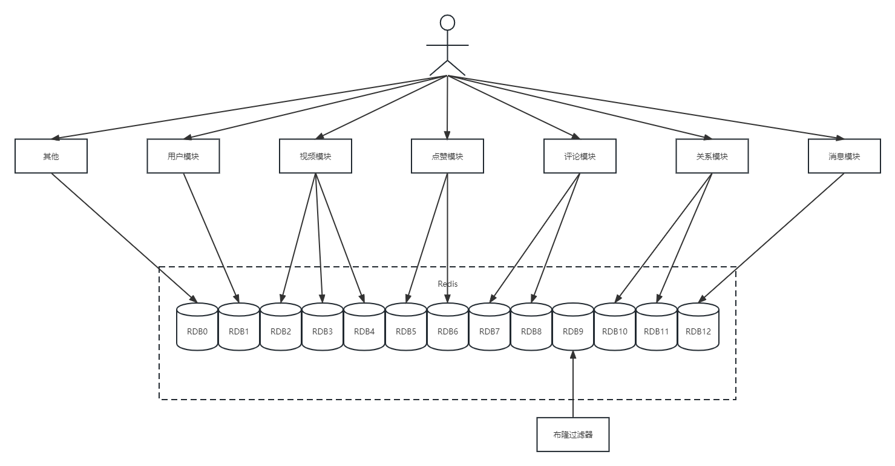

<p align="center">
    
<p>

<p align="center">
    <br />
    <a href="https://github.com/jiangtianxia/simple_tiktok.git">查看本项目的文档 »</a>
    <br />
    <a href="https://ozilj01ufe.feishu.cn/base/bascnXyGKEcJi7vOkiVQVlPvoWc?table=tblOc75EZYVXCah0&view=vewMnpNgGD">查看团队工作文档 »</a>
    <br />
  </p>
</p>

## **项目介绍**

实现极简版抖音服务端


## **目录**
- [上手指南](#上手指南)
    - [开发前的配置要求](#开发前的配置要求)
    - [安装步骤](#安装步骤)
    - [演示界面](#演示界面)
    - [演示视频](#演示视频)
- [文件目录说明](#文件目录说明)
- [开发的整体设计](#开发的整体设计)
   - [服务模块设计](#服务模块设计)
   - [整体的架构图](#整体的架构图)
   - [数据库的设计](#数据库的设计)
   - [Redis架构的设计](#Redis架构的设计)
   - [RocketMQ架构的设计](#RocketMQ架构的设计)
- [使用技术](#使用技术)
- [性能测试](#性能测试)
- [总结与反思](#总结与反思)
   - [目前仍存在的问题](#目前仍存在的问题)
   - [已识别出的优化项](#已识别出的优化项)
   - [架构演进的可能性](#架构演进的可能性)
   - [项目过程中的反思与总结](#项目过程中的反思与总结)
- [参与开源项目](#如何参与开源项目)
- [版本控制](#版本控制)
- [贡献者](#贡献者)
- [鸣谢](#鸣谢)


### **上手指南**

#### 环境配置

##### **开发版**

1. go 1.17.8

2. Mysql 8.0.32 

3. Redis 7.0.8、rebloom 1.1.1

4. RocketMQ 4.4.0

5. 腾讯云对象存储COS

6. [抖声客户端app](https://pan.baidu.com/s/194g4bi9ETFWiXEgPM5qDng?pwd=jtiu)

##### **上线版**

1. Ubuntu 20.04 LTS

2. docker 20.10.23、docker-compose 2.13.0

3. 腾讯云对象存储COS

4. [抖声客户端app](https://pan.baidu.com/s/194g4bi9ETFWiXEgPM5qDng?pwd=jtiu)


#### 安装步骤

```
git clone https://github.com/jiangtianxia/simple_tiktok.git
```

##### **分支说明**

**master**：主分支，目前存放开发版代码。

**develop**：开发分支，存放开发版代码。

**release**：上线分支，存放上线版代码。


**开发版与上线版主要区别**

1. 图片上传地址不同，开发版封面保存在本地，而上线版保存在远程服务器，即config/app.yml中的uploadAddr不同。

2. gin模式和图片访问方式不同，开发版用gin来加载静态资源，而上线版直接使用nginx来进行转发和访问，即router/app.go有区别。

2. yaml和mysql初始化不同，即utils/system_init.go有区别。

##### **开发版**

1. 下载源码

2. 执行sql文件夹下的sql文件，创建相关表

3. 打开config文件夹下的app.yml文件，修改mysql、redis、rocketmq、cos等配置信息

4. 启动服务

5. 在客户端app配置相关地址服务端地址

##### **上线版**

1. 下载源码

2. 修改docker-compose.yml、Dockerfile和docker文件夹下的相关信息，配置部署信息

3. 打开config文件夹下的app.yml文件，修改mysql、redis、rocketmq、cos、nginx等配置信息

4. 使用docker-compose命令部署服务，查看容器状态，查看个个容器的日志检查是否部署成功

5. 执行sql文件夹下的sql文件，创建相关表

6. 在客户端app配置相关地址服务端地址

**docker相关命令说明**

**一键部署**：docker-compose up -d

**查看容器状态**：docker ps

**查看日志**：docker logs dockerName/ID


#### 演示界面
**基础功能演示**


**拓展功能演示**


**设置服务端地址**


#### 演示视频

[](https://www.bilibili.com/video/BV1954y1F73i)


### **文件目录说明**
```
simple_tiktok
├── config               // 配置文件包
├── controller			 // 控制层包
├── dao
│   ├── mysql			 // mysql数据库访问
│   └── redis			 // redis数据库访问
├── docker				 // docker部署容器配置文件夹
│   ├── mysql			 // mysql容器配置文件夹
│   ├── nginx            // nginx容器配置文件夹
│   ├── redis			 // redis容器配置文件夹
│   └── rocketmq		 // rocketmq容器配置文件夹
├── docs                 // swagger接口文档
├── images      
├── logger				 // 日志配置
├── middlewares          // 中间件层
├── models               // models层
├── rocketmq			 // 消息队列
├── router               // 路由信息
├── service              // 服务层
├── sql					 // 数据库结构sql文件
├── test				 
├── upload				 // 文件上传位置
├── utils				 // 工具包，包含雪花算法、jwt、布隆过滤器、cos和md5加密包
├── Dockerfile
├── go.mod
├── go.sum
├── main.go
└── README.md
```


### **开发的整体设计**

#### 系统架构图



#### 数据库设计


#### Redis架构设计

**缓存策略**


**Redis架构图**




#### RocketMQ架构设计


#### 服务模块设计

###### 用户模块的设计
用户模块包括用户注册、用户登录和用户信息获取，详情：[用户模块设计说明](https://ozilj01ufe.feishu.cn/docx/P4Asd72jsoQTvQxcDAhcVmlEnJg) 。

###### 点赞模块的设计
点赞模块包括点赞操作、取消赞操作、获取点赞列表。详情：[点赞模块设计说明](https://vyhsij84iy.feishu.cn/docx/KoX0dJlHnoNJP2xvXnfc1HbJn0f) 。

###### 评论模块的设计
评论模块包括发布评论、删除评论、查看评论。详情：[评论模块设计说明](https://bytedancecampus1.feishu.cn/docx/VhzHd95ccoU0LexA37ic5nNTn4t) 。

###### 视频模块的设计
视频模块包括视频流、视频投稿、获取发布视频列表。详情：[视频模块设计说明](https://nn2h7776xm.feishu.cn/docx/BL80d9z7Qo5sZzxPqYjca5VLntd)。

###### 消息模块的设计
消息模块包括聊天记录和消息操作。详情：[消息模块设计说明](https://ozilj01ufe.feishu.cn/docx/V23UdBH5boF5Dwxjw9qcPMZbnfh) 。

###### 关注模块的设计
关注模块包括关注操作、关注列表、粉丝列表、好友列表。详情：[关注模块设计说明](https://eeoleff3z7.feishu.cn/docx/MXZUdTbyEoJJMRx1xRUczlaXnaf) 。


### **使用技术**
框架相关：
- [Gin](https://gin-gonic.com/docs/)
- [Gorm](https://gorm.io/docs/)

服务器相关：

- [Nginx](https://www.nginx-cn.net/)

中间件相关：
- [Redis](https://redis.io/docs/)
- [RocketMQ](https://rocketmq.apache.org/)

数据库：
- [MySQL](https://dev.mysql.com/doc/)
- [COS](https://cloud.tencent.com/product/cos)


### **性能测试**

通过命令 go tool pprof -http=:6060 "http://localhost:8080/debug/pprof/profile?seconds=600" ，然后在600s内，将全部接口测试一遍，生成火焰图。


同时包含各个接口的压力测试，详情请阅读[压测报告](https://vyhsij84iy.feishu.cn/docx/ACRXdM6YloiDmyxaXk8czxshnXq) 获得具体的压力数据。


### **总结与反思**

#### 目前仍存在的问题

1. 以接口而非模块作为区分文件的单位，导致了部分代码的冗余。	

2. 因时间紧促存在代码风格不一致的问题，部分代码欠优化。

3. 缓存策略需要优化，由于缓存数据结构的多，访问一个接口需要访问多个数据结构从而导致时间过长。

#### 已识别出的优化项

1. 使用gorm作为ORM框架，提高了开发效率，同时依赖gorm的预编译机制防止sql注入。 

2. 使用jwt进行token授权和验证，保证了系统的安全性。

3. 使用消息队列RocketMQ实现解耦和削峰，减少用户等待时间，优化用户体验，同时可以防止单位时间内请求过多导致服务端崩溃。

4. 使用Redis实现缓存，通过布隆过滤器+缓存空对象解决缓存穿透问题，并依赖消息队列的重试机制解决数据库与缓存不一致的问题。

#### 架构演进的可能性

目前项目采用的是单体架构在一定程度上可以满足应用程序的需求，但随着应用程序的不断发展和业务的不断扩展，单体架构也会出现一些问题，比如：

1. 扩展困难：单体架构将整个应用程序封装在一个进程中，很难将应用程序的各个部分进行分离和独立部署，从而影响应用程序的可扩展性。

2. 可维护性下降：单体架构通常是一个庞大的代码库，随着业务逻辑的增加，代码的规模不断扩大，维护难度逐渐增大。

3. 故障扩散：单体架构中的一个故障往往会影响整个应用程序的正常运行，难以快速定位和修复。

未来架构演进的可能性包括：

1. 微服务架构：将单体架构中的各个功能模块拆分成独立的服务，每个服务都运行在自己的进程中，从而实现服务的独立部署和扩展，提高应用程序的可扩展性和可维护性。

2. 容器化架构：将应用程序和它的所有依赖项打包成容器，这些容器可以在任何地方运行，从而提高应用程序的可移植性和部署效率。

3. 无服务架构：将应用程序的功能抽象成函数，通过云服务提供商的无服务器计算平台来运行这些函数，无需关心底层的服务器和基础设施，从而实现弹性扩展和更高的可用性。

总的来说，未来架构演进的目标是提高应用程序的可扩展性、可维护性和可用性，通过使用适合当前业务需求的架构来实现。

#### 项目过程中的反思与总结

1. 安全性有待加强，还需要注意项目的安全性。对于用户上传的视频、图片等敏感数据，需要进行安全的存储和传输，避免数据泄露等安全问题。 同时，还需要考虑到网络安全、服务器安全等方面的问题，采取相应的措施保证系统的安全性。

2. 在项目开发中，需要注重代码的可读性、可维护性和可扩展性。合理的代码结构、注释和命名，可以让代码更易于理解和维护。在开发过程中，需要考虑到应用可能的扩展和变更，设计可扩展的架构。


### **参与开源项目**

贡献使开源社区成为一个学习、激励和创造的绝佳场所。你所作的任何贡献都是**非常令人感谢**的。

1. Fork the Project

2. Create your Feature Branch (`git checkout -b feature/AmazingFeature`)

3. Commit your Changes (`git commit -m 'Add some AmazingFeature'`)

4. Push to the Branch (`git push origin feature/AmazingFeature`)

5. Open a Pull Request


### **版本控制**

该项目使用Git进行版本管理。您可以在repository参看当前可用版本。

我们欢迎其他的贡献者参与此项目，在这之前，您需要遵循[Git 分支管理规范](https://ypbg9olvt2.feishu.cn/docs/doccnTMRmh7YgMwL2PgZ5moWUsd)和[注释规范](https://juejin.cn/post/7096881555246678046)。


### **贡献者**

- 江泽彬 https://github.com/jiangtianxia
- 裴君辉 https://github.com/paradoxskin
- 刘昕 https://github.com/TomiokapEace
- 张啸宇 https://github.com/TemplarX-boop
- 段欣悦 https://github.com/CynthiaZzzzzzzzz
- 徐龙 https://github.com/longxu0509

您也可以查阅仓库为该项目做出贡献的开发者。


### **鸣谢**

- [字节跳动后端青训营](https://youthcamp.bytedance.com/)
